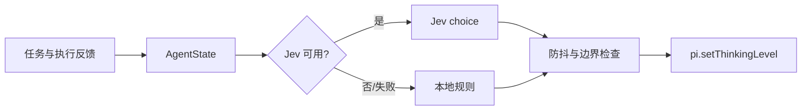

# pi-thinking-router-jev

> 面向 [pi](https://pi.dev) 的自适应 Thinking Level 路由器：根据任务状态和执行反馈，在 `low / medium / high / xhigh` 之间动态选择合适档位。

[](https://github.com/Wh0rigin/pi-jev-router/actions/workflows/ci.yml) [](test/README.md) [](https://pi.dev)

它只负责一件事：读取 Agent 状态 → 咨询 Jev 或本地规则 → 调用 `pi.setThinkingLevel()`。它不会切换模型、修改代码或接管 Agent Loop。

## 功能

- 任务开始时选择初始档位；推理型失败时按需升级；连续稳定时尝试降级。
- 使用 Jev 的离散选择结果，并在 Jev 未配置或调用失败时自动切换到本地规则。
- 内置防抖、升级/降级上限、任务基线、冷却窗口和手动接管，避免档位频繁跳动。
- 通过 JSONL 记录每次决策，便于排查和统计。

## 工作方式



路由只在以下时机评估：

| 时机 | 行为 |
|---|---|
| `task-start` | 为新任务选择初始档位；steer/follow-up 不重复初始化 |
| `failure` | 仅推理型失败触发升级评估；网络、Docker、限流等环境问题不会升级 |
| `downgrade-check` | 连续稳定达到阈值后评估降级 |
| 手动改档 | 进入 `manual-override`，静默到下一任务 |

默认保护策略：单次最多调整一档；每个任务最多升/降各 2 次；降级需要稳定窗口；新鲜推理失败可以绕过 Jev 冷却窗口。

## 安装

将仓库注册到 pi 的 `~/.pi/agent/settings.json`：

```json
{
  "extensions": ["C:/path/to/pi-thinking-router-jev"]
}
```

或仅在当前会话临时加载：

```bash
pi -e ./index.ts
```

## 配置

配置文件为 `~/.pi/thinking-router.json`，也可以使用 `/thinking-router set <key> <value>` 修改：

```json
{
  "enabled": true,
  "endpoint": "<jev endpoint>",
  "model": "jev-latest",
  "providerId": "<cc-switch provider id>",
  "logEnabled": true,
  "logFile": "~/.pi/thinking-router/decisions.jsonl"
}
```

API key 的读取顺序为：`config.apiKey` → `JEV_API_KEY` → cc-switch 凭据库。

未配置 `endpoint` 或 `model` 时，路由器会提示一次，然后使用本地规则继续工作：文档任务默认 `low`，实现/调试/测试默认 `medium`，架构/优化默认 `high`。

## 命令

```text
/thinking-router            # 开关自动路由
/thinking-router status     # 查看当前档位、来源、计数和日志路径
/thinking-router test       # 真实调用一次 Jev 测试连通性
/thinking-router set k v    # 修改配置
/thinking-router log        # 查看最近 5 条决策
```

状态栏示例：`jev:medium`、`jev:medium(rules)`、`jev:medium(fallback)`、`jev:medium(manual)`。

## 验证

```bash
npm test                                      # 单元 + 集成测试，完全离线
JEV_LIVE=1 npm run test:live                  # 真实 Jev 连通性
npm run ping                                  # Jev 双探针
npm run benchmark                             # 3-seed A/B 实验
```

- [测试设计与运行手册](test/README.md)：测试分层、mock Jev、错误分类、回归用例和实验方法。
- [验证结果与图表](docs/validation.md)：真实 Jev、E2E、A/B 实验结果及复现说明。

## 仓库结构

```text
src/                 核心状态、策略、Jev 客户端、配置和日志
index.ts             pi 扩展入口与 /thinking-router 命令
test/                单元、集成和 live 测试
scripts/             Jev 探针、A/B 基准和图表脚本
assets/              验证结果图表
docs/validation.md   详细验证结果
```

## 限制与后续计划

当前实现用关键词近似任务类型，用相关路径近似相关文件；pi 的通知型事件也无法阻止用户手动改档。Jev 是概率模型，因此最终档位由本地防抖层约束。

后续可扩展历史任务统计、成本/延迟报表、决策缓存，以及独立的 `pi-model-router-jev` 模型路由项目。

实验环境：pi 0.86.1、Node 24、Windows；详细数据和边界说明见[验证文档](docs/validation.md)。
